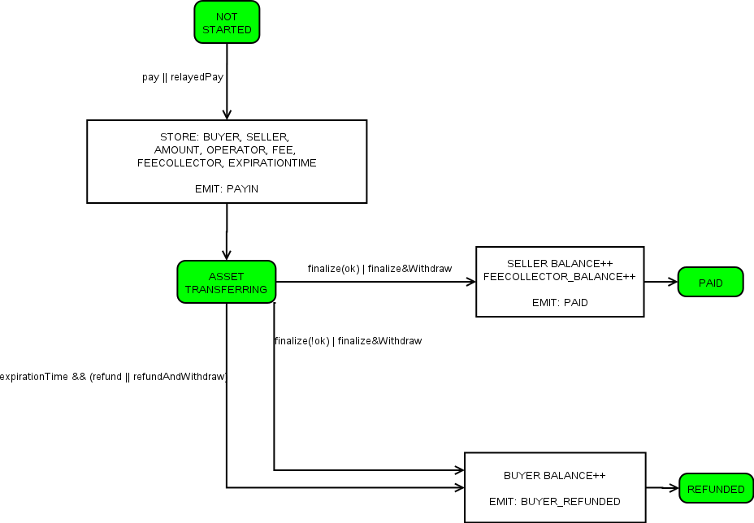
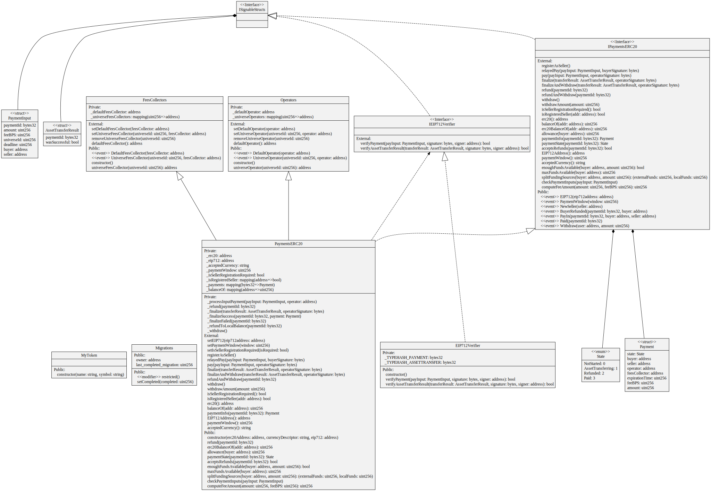

# Payments in Crypto - Solidity Contract


## Install and tests
```
npm ci 
npm test
```


## Description

```
/**
 * @dev Upon transfer of ERC20 tokens to this contract, these remain
 * locked until an Operator confirms the success or failure of the
 * asset transfer required to fulfil this payment.
 *
 * If no confirmation is received from the operator during the PaymentWindow,
 * all tokens received from the buyer are made available to the buyer for refund.
 *
 * To start a payment, one of the following two methods needs to be called:
 * - in the 'pay' method, the buyer is the msg.sender (the buyer therefore signs the TX),
 *   and the operator's EIP712-signature of the PaymentInput struct is provided as input to the call.
 * - in the 'relayedPay' method, the operator is the msg.sender (the operator therefore signs the TX),
 *   and the buyer's EIP712-signature of the PaymentInput struct is provided as input to the call.
 *
 * This contract maintains the balances of all users, it does not transfer them automatically.
 * Users need to explicitly call the 'withdraw' method, which withdraws balanceOf[msg.sender]
 * If a buyer has a non-zero local balance at the moment of starting a new payment, 
 * the contract reuses it, and only transfers the remainder required (if any) 
 * from the external ERC20 contract. 
 *
 * Each payment has the following State Machine:
 * - NOT_STARTED -> ASSET_TRANSFERRING, triggered by pay/relayedPay
 * - ASSET_TRANSFERRING -> PAID, triggered by relaying assetTransferSuccess signed by operator
 * - ASSET_TRANSFERRING -> REFUNDED, triggered by relaying assetTransferFailed signed by operator
 * - ASSET_TRANSFERRING -> REFUNDED, triggered by a refund request after expirationTime
 *
 * NOTE: To ensure that the payment process proceeds as expected when the payment starts,
 * upon acceptance of a pay/relayedPay, the following data: {operator, feesCollector, expirationTime}
 * is stored in the payment struct, and used throughout the payment, regardless of
 * any possible modifications to the contract's storage.
 *
 * NOTE: The contract allows a feature, 'Seller Registration', that can be used in the scenario that
 * applications want users to prove that they have enough crypto know-how (obtain native crypto,
 * pay for gas using a web3 wallet, etc.) to interact by themselves with this smart contract before selling,
 * so that they are less likely to require technical help in case they need to withdraw funds. 
 * - If _isSellerRegistrationRequired = true, this feature is enabled, and payments can only be initiated
 *    if the payment seller has previously exectuted the registerAsSeller method.
 * - If _isSellerRegistrationRequired = false, this feature is disabled, and payments can be initiated
 *    regardless of any previous call to the registerAsSeller method.
 */
```

## State Machine




## UML Diagram


